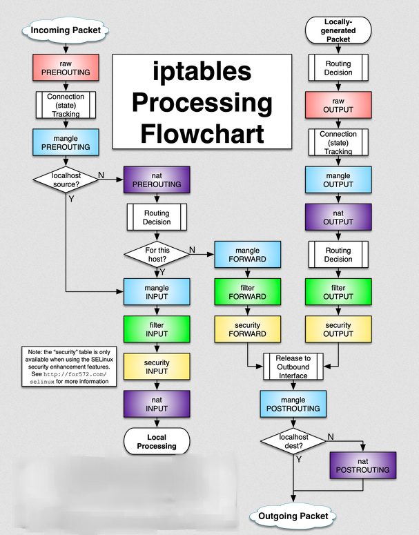
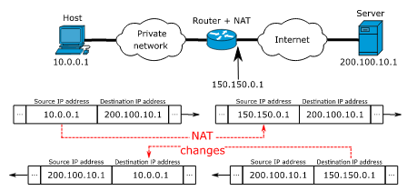
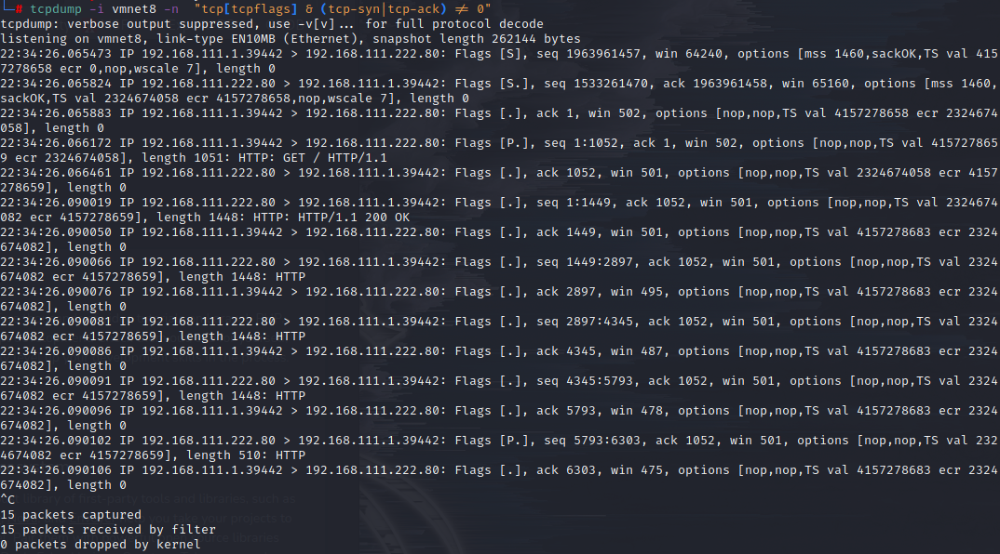
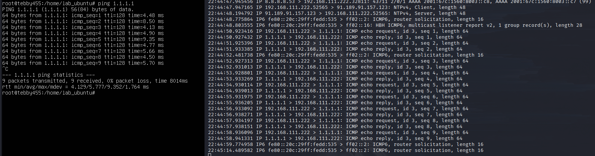
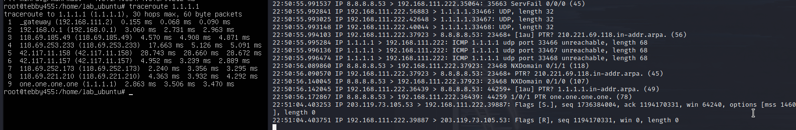
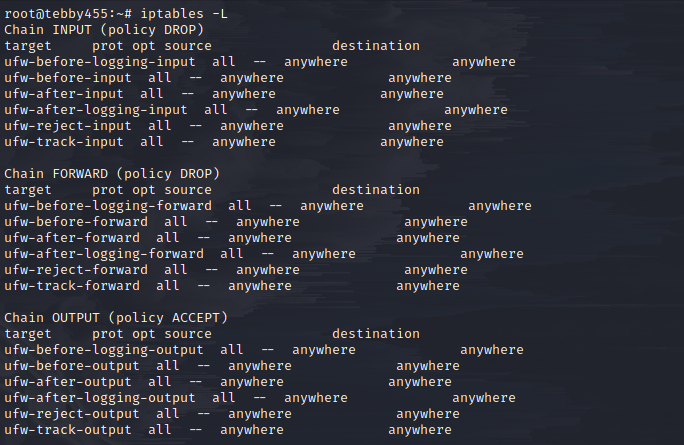

# Iptables

#### Introduce 
- **iptables** is a Firewall in Linux, allow setting own rules for managing acces, improving security. When use a server, Firewall is an important tool to deny any suspicious access. In Linux systems, **iptables** is created by **Netfilter Organization**, **iptables** include two parts: Iptables/Netfilter. **Netfilter** in Linux core and **iptables** outside core, **iptables** respone to communicate with users, add rules to **Netfilter** handle. **Netfilter** filters packages in IP Address, **Netfilter** works in core system so that your system works smoothly.

***

# Outline

<a href='#Section1' style='text-decoration: none'>I. iptables packet flow diagram</a>

<a href='#Section2' style='text-decoration: none'>II. Demo: Using module TRACE to capture packet</a>

<a href='#Section3' style='text-decoration: none'>III. iptables rules</a>

<a href='#Section4' style='text-decoration: none'>VI. tcpdump basics to debug network</a>

***

## I. Iptables packet flow diagram

1. **Flow Diagram**

2. **Ingredients of Iptables**

- Mechanism filter packages of iptables is separate into three main elements: tables, chains, target. There are many tables but by default working, iptables works with fileter table.
- In tables, these are linked with chains. Chains link in tables allow filter packages in different stages. Example, you can handle packages immediately when these packages come to interface, or handle packages before these pop out interface. You can create specific rule, example create specific rules anti DDOS, that is work in my Company.

    2.1. **Tables**

    - Iptables use tables to define specific rules for packages. Currently, iptables have 5 tables:

        a. **Filter table**
        - This table, user usually use, it response to filter packages, decide destination of packages or deny request of packages.
        -  It contains three chains: forward chain, input chain, output chain

        b. **Mangle table**
        - This table relates to modify header of packages, example modify these fields: TTL (Time to live), MTU (Maximum Transmission Unit), Type of Service.
        - It contains 5 chains: pre-routing chain, input chain, post-routing chain, forward chain, output chain.

        c. **NAT table**
        - NAT table is used to tranlate IP Address by specific rules. As your known, all IP Address we used are in private IP, it has to tranlate to Public IP over the Internet that depend on ISP (Internet Service Provider). When packages come to Network Stack, NAT table will change IP of package which mean public IP into private IP following to rules in NAT table.

            

        - It contains 2 chains: pre-routing chain and post-routing

        d. **Raw table**
        - Raw table is known as statefu firewall it has releation with packages which are rated before or existed. Raw table allow to work with packages before the kernel check status packages. 
        - It contains 2 chains: pre-routing chain and output chain

        e. **Security table (it included in CentOS)**
        - Security table may support addition some kernel using by SELinux to setting security policies.

    2.2 **Chains**
    - Each tables created with some chains. Chains allow to filter packages in different stage. Iptables can setting with these chains:

        a. **Pre-routing chain**
        - Rule is executed immdiately packages when it comes to Network Interface. Pre-routing exist in: NAT table, mangle table and raw table.

        b. **INPUT chain**
        - Rule is executed immediately before packages come to process. This chain exists in: raw table, mangle table and NAT table.

        c. **OUTPUT chain**
        - Rule is executed immediately after packages created by process. This chain exists in: raw table, mangle table and filter table.

        d. **Forward chain**
        - Rule executes for packages that are routed through the current server. This chain exist in: mangle table and filter table.

        e. **Post-routing chain**
        - Rule executes immediately when packages leave Network Interface. This chain exist in: mangle table and NAT table.

    2.3 **Target**
    - Target is an action apply for packages when these match rules. 

        a. **ACCEPT**
        - iptables accepts package, move it to system without checking it.

        b. **DROP**
        - iptables remove package, cancel handle it.

        c. **REJECT**
        - The function **DROP**, however **REJECT** will send an error message to host sent package.

        d. **LOG**
        - iptables accept package but information of package will be written by syslog.

        e. **RETURN**
        - iptables will cause the current packet to stop traveling through the chain

3. **Scenario**

- You can view the Flowchart <a href='#flow' style='text-decoration: none'>here</a>

a. **Path of package has destination is IP server**

> Packet > raw/Pre-routing check state > mangle/Pre-routing if it has source form localhost, in here situation is NOT > nat/Pre-routing translate from public IP into private IP, is it for host, in situation is YES (dest is IP server) > mangle/Input > filter/Input > security/Input > nat/Input > Local Processing

b. **Path of package from server to outside**

> Locally generated Packet > routing decision > raw/Output check state > mangle/Output > nat/Output check NAT table > routing decision > filter/Output > security/Output > Outbound Interface > mangle/Post-routing check if dest is localhost or not, in this situation is NOT > nat/Post-routing translate from private IP to public IP > Outgoing packet 

c. **Path of package has destination is not IP Server**

> Packet > raw/Pre-routing check state > mangle/Pre-routing if it has source form localhost, in here situation is NOT > nat/Pre-routing translate from public IP into private IP, is it for host, in this situation is NOT > mangle/Forward > filter/Forward > security/Forward > Outbound Interface > mangle/Post-routing check if dest is localhost or not, in situation here is NOT > Outgoing packet means DROP this packet

***

## II. Demo: Using module TRACE to capture packet

- There are many tools for Network Packet Analyzers, example Wireshark, but it uses in GUI, however, like a System Admin you are running server in core version (terminal) so that there is not GUI for you, so that in this Demo I use **Tcpdump**.

1. **Capture SYN, from IP Company to IP in Virtual machine**

    `tcpdump -i vmnet8 -n`

    

    > The Client machine request to web server (virtual machine 192.168.111.222) 

    > client wants to establish a connection with server so it send a segment with SYN (flag [S])
    > server responds to the client request with syn-ack (flag [S.]) 
    > in the final part client ack the response of server and they both establish a reliable connection with start data transfer (flag [.])

2. **Capture icmp from virtual machine to 1.1.1.1**

    `tcpdump -i vmnet8 -n`

    `ping 1.1.1.1` in virtual machine

    

    
    `traceroute 1.1.1.1` to see the route packets trace to network host 1.1.1.1

***

## III. iptables rules

`iptables -L`
> show all of current rules in iptables

- There are options in iptables:

    * Add rule: -A
    * Delete rule: -D
    * Replace rule: -R 
    * Insert rule: -I

1. **Allow/Deny IP access to IP dest [port]**

- **Allow IP** 

`iptables -A INPUT -s [IP/mask] -d [IP/mask] -dport [port] -j ACCEPT`

> -A INPUT: add a rule
> -s: source IP, example x.x.x.x/24
> -d: dest IP, example x.x.x.x/24
> -dport: dest port
> -j: target, in here allow an IP, i use ACCEPT
> if you want to allow port in source IP use -p

- **Deny IP**

`iptables -A INPUT -s [IP/mask] -d [IP/mask] -dport [port] -j DROP`

> -A INPUT: add a rule
> -s: source IP, example x.x.x.x/24
> -d: dest IP, example x.x.x.x/24
> -dport: dest port
> -j: target, in here deny an IP, i use DROP
> if you want to deny port in source IP use -p

2. **Allow/Deny all new IP access to dest IP [port]**

- Every new connection will send a request [S] (syn) before, so I use `--syn` to filter package

- **Allow**

`iptables -A INPUT -p tcp --syn -d [IP] -dport [port] -j ACCEPT`

> -p tcp --syn: with all ip request to establish to server allow it

- **Deny**

`iptables -A INPUT -p tcp --syn -d [IP] -dport [port] -j DROP`

> -p tcp --syn: with all ip request to establish to server deny it

3. **Allow/Deny IP access to IP dest [port] with TTL and Length**

- **Allow**

`iptables -A INPUT -s [IP/mask] -d [IP/mask] -dport [port] -m --ttl-eq 128,64 -m length --length 1000 -j ACCEPT`

> -m: add a module
> --ttl-eq: ttl equal to given ttl

- **Deny**
`iptables -A INPUT -s [IP/mask] -d [IP/mask] -dport [port] -m --ttl-eq 128,64 -m length --length 1000 -j DROP`

4. **Comment for iptables rule**

`iptables -A INPUT -m comment --comment "[content]"`

***

## IV. tcpdump basics to debug network

`tcpdump -i [interface]`
> capture on interface

`tcpdump host x.x.x.x`
> capture on filter by IP address

`tcpdump src x.x.x.x` or `tcpdump dst x.x.x.x`
> filter by source and dest

`tcpdump [protocol]`
> filter by protocol icmp, tcp ,udp

`tcpdump -i [interface] -n  "tcp[tcpflags] & (tcp-syn|tcp-ack) == tcp-syn|tcp-ack"`
> filter by flag syn and ack

`tcpdump -F [file]`
> use file to add filter expression

`tcpdump -O`
> do not optimize output

`tcpdump -w`
> write output to a file

- These are flags in tcpdump:

    * ACK = not displayed or elsewhere
    * `PSH = flag[P]`: Push data
    * `RST = flag[R]`: Reset connection
    * `SYN = flag[S]`: start connection
    * `FIN = flag[F]`: finish connection
    * `SYN-ACK = flag[S.]`: SynAck packet
    * `flag[.]`: no flag set

